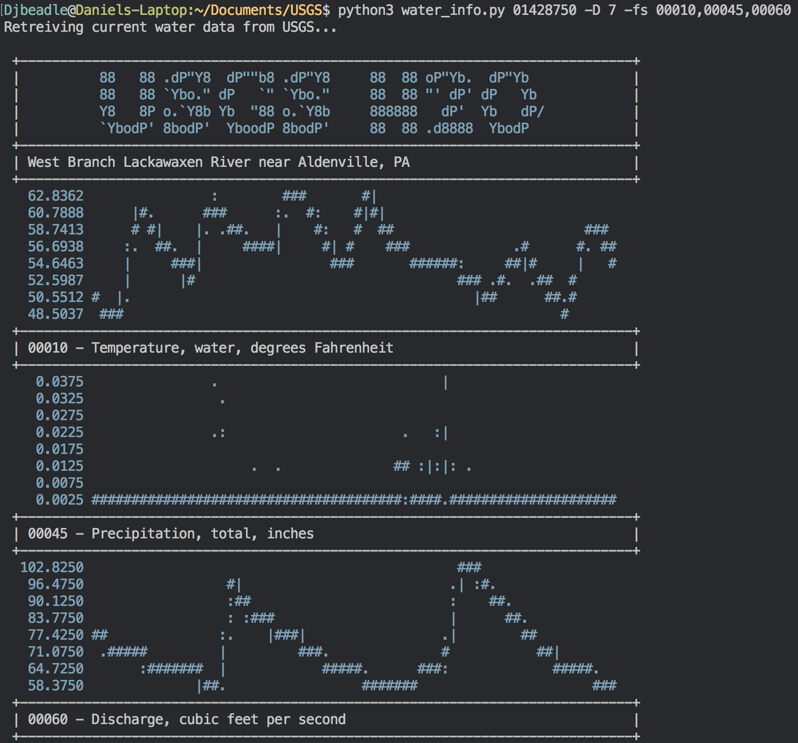
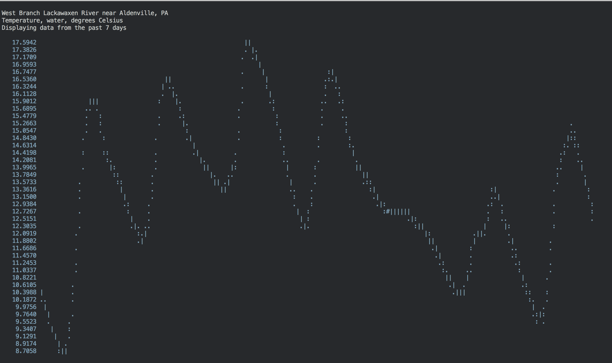

Do you need to see plots of USGS water data in your command line? Probably not! But now you can.

[https://danielbeadle.net/blog/post/2018-04-01-usgs-water-cli/](https://danielbeadle.net/blog/post/2018-04-01-usgs-water-cli/)

Now has the ability to graph data- [in your terminal](https://github.com/imh/hipsterplot)!

Each measurement is specified by a 5 digit code. By default all measurements are displayed, but if you only want to display a specific measurement you can specify the code. You can look up the codes on the [USGS codes and parameters webpage](https://help.waterdata.usgs.gov/codes-and-parameters/parameters).

# Screenshots
The default, dashboard mode:

Large mode, for custom sized graphs:
