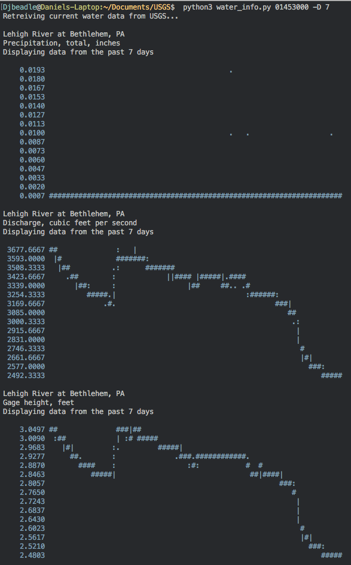

Do you need to see plots of USGS water data in your command line? Probably not! But now you can.

[https://danielbeadle.net/blog/post/2018-04-01-usgs-water-cli/](https://danielbeadle.net/blog/post/2018-04-01-usgs-water-cli/)

Now has the ability to graph data- [in your terminal](https://github.com/imh/hipsterplot)!

~~~bash
usage: water_info.py [-h] [-d] [-w] [-r] [-x X] [-y Y] (-C | -D D | -H H) id

Retrieves current USGS water data so you don't have to leave your command line.
To find a local sensor, check https://waterdata.usgs.gov/nwis/rt

examples:
    python3 water_info.py 11141280 -H 24
    python3 water_info.py 01453000 -D 7
    python3 water_info.py 04288295 -C

If x & y values are not specified, the default graph width and height is 70 and 15

positional arguments:
  id

optional arguments:
  -h, --help  show this help message and exit
  -d          Debug mode, prints out url being queried
  -w          Print waves
  -r          Output the raw data only
  -x X        Specify the width of the graph
  -y Y        Specify the height of the graph
  -C          Current data only
  -D D        Specify the number of days you want data for
  -H H        Specify the number of past hours you want data for
  ~~~

